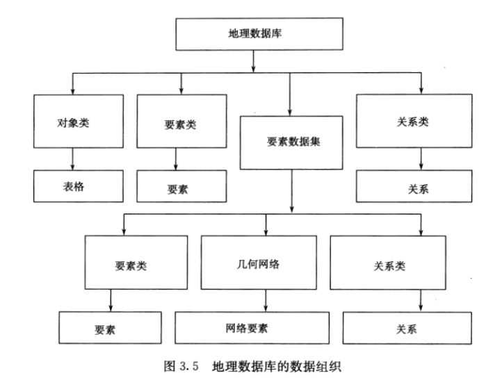

### ArcGIS 模块总结

#### 1. 基本操作

1. 数据的添加、编辑、保存、选择与导出
2. 利用属性制作统计图表

```
1. 添加XY数据：txt文本或xls表格，然后导出为图层
2. 数据框坐标系：查看当前坐标系，也可实现投影
3. 地图显示参数：
	1. 地图单位和显示单位
	2. 参考比例，用来设置标注显示的大小，不设置字体的大小就不会发生变化。
4. 组图层：将多个图层作为一个图层处理。包含的图层之间没有相互冲突的属性，比如铁路和公路组合为“交通网络”。
5. 显示比例尺：只在一定比例尺范围内显示。属性->常规/右键图层->设置最小比例尺
6. 绝对路径和相对路径
7. 制作专题图，可新建数据框，右击激活，跳转到布局视图
8. 选择要素三种方式：属性SQL、位置、框选
9. 导出选中要素：
	1. 根据所选要素创建图层
	2. 导出数据
10. 创建图层和符号化
11. 数据库转为ShapeFile 和 导入ShapeFile到数据库
12. 属性表导出 ： 带中文的表导出为txt文本，excel打开分隔符为逗号
13. 环境设置：右击ArcToolBox
14. 添加字段：
	1. 属性表中添加
	2. 目录中查看属性，在字段选项卡中添加
15. 地理数据库
	导入要素（独立要素类，必须指定坐标系）
	新建要素数据集：指定空间参考
	在数据集中新建要素类不需要再指定坐标系。
	建立关系表
	导入栅格数据集
		栅格数据集->加载数据 可实现镶嵌操作
	建立索引（针对表和要素）
16. 属性域，是属性取值范围。只有数据库能设置属性域，了解即可。
17. 关系类
```



```
	对象类是指存储非空间数据的表格(Table)。
	要素类是具有相同几何类型和属性的要素的集合，即同类空间要素的集合，如河流、道路、植被、用地、电缆等。要素类之间可以独立存在，也可具有某种关系。当不同的要素类之间存在关系时，应考虑将它们组织到一个要素数据集（要素集）中。
	要素数据集是共享空间参考系统并具有某种关系的多个要素类的集合。一般而言，在以下三种情况下，应考虑将不同的要素类组织到一个要素数据集中:
	(1）当不同的要素类属于同一范畴。例如，全国范围内某种比例尺的水系数据，其点、线、面类型的要素类可组织为同一个要素数据集。
	(2）在同一几何网络中充当连接点和边的各种要素类，必须组织到同一要素数据集中。如配电网络中，有各种开关、变压器、电缆等，它们分别对应点或线类型的要素类，在配电网络建模时，应将其全部考虑到配电网络对应的几何网络模型中去。此时，这些要素类必须放在同一要素数据集下。
	(3）对于共享公共几何特征的要素类，如用地、水系、行政区界等。当移动其中的一个要素时，其公共的部分也要求一起移动，并保持这种公共边关系不变。此种情况下，也要将这些要素类放到同一个要素数据集中。
	对象类、要素类和要素数据集是地理数据库中的基本组成项。当在数据库中创建了这些项目后，就可以向数据库中加载数据，并进一步定义数据库，如建立索引、创建拓扑关系、创建子类、几何网络类、注释类、关系类等。
```

```
关系类：
	空间对象存储在要素类中，非空间对象存储在对象类中，关系类存储在关系类中
1. 关系类概述
	基数
		描述对象之间的关系，一对一、一对多、多对一、多对多
	关联键
		即公共字段，数据类型必须一致
	关联标注
		**
	关联种类
		**
2. 建立关系类
```


#### 2. 拓扑关系

```
1. 子类型
	用来标注属性值的别名
2. 先创建要素数据集，然后创建拓扑，创建拓扑规则
```


#### 3. 投影

1. 定义投影、投影变换、数据变换
2. 数据格式转换
3. 数据处理

#### 4. 符号化

1. 矢量数据符号化
2. 栅格数据符号化
3. 制作专题图

#### 5. 空间分析原理

1. 区分矢量和栅格数据模型
2. 空间分析模式

#### 6. 矢量数据空间分析

1. 缓冲区
2. 叠置分析：擦除、标识、相交、交集取反、联合、更新
3. 网络分析
4. 追踪分析
5. 实例：市区择房、最短路径

#### 7. 栅格数据空间分析

1. 环境设置：工作空间、像元大小、处理范围等等
2. 距离制图：直线距离、区域分配、成本距离、最短路径
3. 密度制图
4. 栅格插值：IDW、样条等
5. 表面分析：等值线、地形因子提取、山体阴影
6. 统计分析：像元统计、邻域统计、分类区统计
7. 重分类：替换新值、NoData设置
8. 栅格计算器：基本运算、常用函数
9. 多元分析：ISO聚类、最大似然分类、主成分分析、树状图
10. 实例：学校选址、最佳路径、熊猫分布密度、GDP区域分布图的生成与对比、山顶点提取

#### 8. 三维分析

1. 创建表面：栅格表面生成、TIN创建
2. 表面分析：计算表面积、体积、坡度、坡向、可视性、提取断面
3. ArcScene 要素立体显示、飞行
4. 二维要素三维化、表面数据的矢量转换
5. 实例：地形指标提取、地形特征信息提取、表面创建及景观图制作、污染物在畜水层中的可视化、模拟场景飞行、爆炸影响分析

#### 9. 地统计分析

1. 基础：原理、克里金插值
2. 了解各种插值，应用场景
3. 实例：插值生成DEM

#### 10. 水文分析

1. 无洼地DEM
2. 汇流累积量
3. 河流长度
4. 河网提取
5. 流域分割
6. 实例：提取山脊线、山谷线、地形鞍部提取、沟谷网络提取和沟壑密度计算

#### 11. 建模

大赛用不到

#### 12. 综合题

数据编辑和更新、最短路径、土壤稳定性、找出某种珍贵药材的生长区域、城市建筑日照分析


#### 附：比赛要求

一、竞赛内容

​	从信息流的视角，GIS是指利用计算机软硬件系统，对整个或部分地球表层的有关地理空间数据进行采集、储存、管理、分析和输出的计算机应用系统。因此，本届大赛重在了解我国高校GIS学子对GIS基本应用技能的掌握程度，推动高水平GIS应用型人才的培养。本届大赛竞赛的主要内容包括:

1、空间数据的采集编辑与集成处理能力。一是展示学生对地图数据采集、关键技术及常用GIS软件的了解和掌握程度。二是测试学生面对不同比例尺、不同精度、不同结构的多源空间数据，能够应用常用GIS软件进行变换处理，实现满足GIS要求的空间数据库建库能力。

2、空间分析技术的应用。主要测试学生能否灵活应用多种空间分析技术，完成选址分析、工程规划、规划分析、地理现象模拟分析、地理信息提取分析及专题图制图等应用。

二、竞赛模式

本届大赛采用线上竞赛方式，具体规定如下:

1、参赛队伍:为更好的培养团队协作能力，竞赛要求所有参赛选手必须以团队形式参赛，团队成员不得超过4人（限在校本科生)﹔如果参赛学生超过1人，请指定1名学生队长，要求在附件2中填报为1号参赛学生。每个团队应配备1-2位指导老师，并指定其中一位指导教师作为网络监考教师;如果指导教师超过1人，请指定Ⅰ名牵头教师，要求在附件2中填报为1号指导老师。

2、竞赛时长:比赛分两个时段进行,每个时段竞赛时长为150分钟。第一个时段比赛内容为空间数据的采集编辑与集成处理，第二个时段比赛内容为空间分析技术的应用。

> 上午：空间数据的采集编辑与集成处理 大概是矢量化和矢量分析操作
>
> 下午：空间分析

3、竞赛场地和设备:由于采用网络比赛的形式，各参赛队伍须在赛前准备提供一个独立、无干扰的房间，并安装3台摄像头用于远程监考。各参赛队伍须配备4-6台符合组委会要求的计算机作为比赛用机，各参赛队伍须聘请一位非指导教师进行本地监考，比赛用机和本地监考教师的具体要求，详见第3号通知。

4、竞赛题目:比赛当日由相关专家从竞赛题库中抽取本届大赛竞赛题目与数据，所有参赛团队均使用相同参赛题目与数据。

5、软件使用:涉及的专业软件主要包括ArcGIS Desktop 10.8.1、ArcGIS Pro2.8、GeoScene Pro 2.1、SuperMap iDesktop 10i SP1，文档编排软件为MicrosoftOffice 2016。(以上软件的版本号如有变化将另行通知)

6、评分方式:依据组委会事先制定的评分标准对参赛作品评分。

**三、具体竞赛技能说明**

1、空间数据的采集编辑与集成处理

(1)需要熟悉地图数据采集的完整流程，主要包括图像纠正、定向、图层创建、数据采集（会快速准确采集部分点、线、面地图要素)。

> 地理配准、矢量偏移纠正，创建图层、坐标系度转换为区号、矢量化

(2）能对上述采集的数据、遥感影像数据及大赛提供的其他空间数据，进行变换处理（格式变换、空间坐标变换等)，建成规范标准的空间数据库。

> 投影和变换、建立空间数据库

(3）能够针对不同来源的数据，如倾斜摄影数据、地形数据，完成多源数据整合处理。

> 镶嵌？

(4）能对整个操作过程做出归纳总结，并撰写文档材料。说明:上述数据均属于同一个地理区域。

> 同一个地理区域，涉及到坐标系问题、掩膜、处理范围问题，同时注意处理数据时属性表的字段可能有丢失问题

2、空间分析技术的应用

(1）需要熟悉GIS叠置分析、缓冲区分析、网络分析、距离制图分析、数字地形分析及其它空间分析功能，以及具备专题图制作能力。

> 叠置分析、缓冲区分析、网络分析、距离制图分析.基本属于矢量数据的分析。数字地形分析及其它空间分析功能，涉及到栅格数据。会制作专题图，图名图例比例尺指北针。

(2）能够利用指定的数据集，完成选址分析、规划分析、地理现象模拟分析、地理信息提取分析及专题图快速制作等。

> 选址分析、规划分析、地理现象模拟分析、地理信息提取分析。 选址分矢量和栅格两种，其他应当是一些栅格空间分析，和栅格提取值到矢量属性表中。

(3）能够利用指定的数据集，完成通视分析、可视域分析、剖面分析、三维网络分析及三维建模显示等。

> 这些是三维分析的部分，提到这些要了解

(4)能对整个操作过程进行归纳总结，并撰写文档材料。注:比赛内容以上述内容为主，但不局限于上述内容

> 比赛可能会有没做过的东西。
>
> 写文档的时候要详略得当，关键步骤（加分点，和其他人拉开差距）不能少，如果遇到做不出来的步骤，也要把自己的思路理清写到文档中。文档的版式要阅读起来舒服，标题、目录。