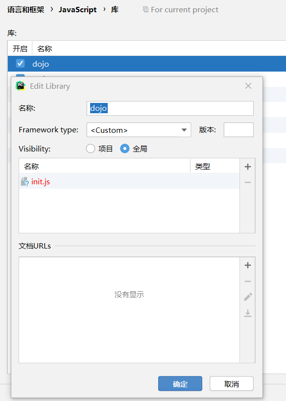

## [ArcGIS API for JavaScript]([ArcGIS API for JavaScript 3.34](https://developers.arcgis.com/javascript/3/))

[Set up a development environment | API Reference | ArcGIS API for JavaScript 3.34](https://developers.arcgis.com/javascript/3/jsapi/api_devenv.html)

## 设置开发环境

Web server:	IIS

​	[（零）ArcGIS API For JavaScript3.17本地部署（IIS）_王培晓Carpenter-CSDN博客](https://blog.csdn.net/LoveCarpenter/article/details/52169705)

​	服务器目录：D:\web

代码编辑器IDE：webstorm

## 安装API

第一种方法：使用CDN

```
<link rel="stylesheet" href="https://js.arcgis.com/3.34/esri/css/esri.css">
<script src="https://js.arcgis.com/3.34/"></script>
```

第二种方法：下载API

+ 复制文件到服务器
+ 修改js文件

将文件复制到服务器：

​		D:\Web\arcgis_js_api

修改js文件：

1. Open `C:\Inetpub\wwwroot\arcgis_js_api\library\3.34\3.34\init.js` in a text editor and search for the text `"https://[HOSTNAME_AND_PATH_TO_JSAPI]dojo"`, and replace this text with `"http://localhost/arcgis_js_api/library/3.34/3.34/dojo"`

   注意localhost是http协议

2. Open `C:\Inetpub\wwwroot\arcgis_js_api\library\3.34\3.34\dojo\dojo.js` in a text editor and search for the text `"https://[HOSTNAME_AND_PATH_TO_JSAPI]dojo"`, and replace this text with `"http://localhost/arcgis_js_api/library/3.34/3.34/dojo"`

http://localhost是服务器地址。可以修改为其他地址，如：https://www.example.com

也可以修改压缩后的js文件：

1. Open `C:\Inetpub\wwwroot\arcgis_js_api\library\3.34\3.34compact\init.js` in a text editor and search for the text `"https://[HOSTNAME_AND_PATH_TO_JSAPI]dojo"`, and replace this text with `"https://www.example.com/arcgis_js_api/library/3.34/3.34compact/dojo"`
2. Open `C:\Inetpub\wwwroot\arcgis_js_api\library\3.34\3.34compact\dojo\dojo.js` in a text editor and search for the text `"https://[HOSTNAME_AND_PATH_TO_JSAPI]dojo"`, and replace this text with `"https://www.example.com/arcgis_js_api/library/3.34/3.34compact/dojo"`

## 测试安装

替换下面的网址为localhost。运行一次。

```html
<!DOCTYPE HTML>
<html>
  <head>
    <meta http-equiv="Content-Type" content="text/html; charset=utf-8"/>
    <title>Test Map</title>
    <link rel="stylesheet" href="https://www.example.com/arcgis_js_api/library/3.34/3.34/esri/css/esri.css" />
    <script src="https://www.example.com/arcgis_js_api/library/3.34/3.34/init.js"></script>
    <style>
      html,
      body,
      #map {
        height: 100%;
        width: 100%;
        margin: 0;
        padding: 0;
      }
    </style>
    <script>
      require([
          "esri/map",
          "esri/layers/ArcGISTiledMapServiceLayer"
      ],function(Map, ArcGISTiledMapServiceLayer) {
          var map = new Map("map");
          //If you do not have Internet access then you will need to point this url to your own locally accessible tiled service.
          var tiled = new ArcGISTiledMapServiceLayer("https://services.arcgisonline.com/arcgis/rest/services/Ocean/World_Ocean_Base/MapServer");
          map.addLayer(tiled);
      });
    </script>
  </head>
  <body>
    <div id="map"></div>
  </body>
</html>
```

注意：

1. http://localhost  不是 https://localhost

2. IIS设置访问目录权限：目录浏览--启用

3. IIS设置标头跨域：

   Access-Control-Allow-Origin  *

   Access-Control-Allow-Headers  *

3. "https://services.arcgisonline.com/arcgis/rest/services/Ocean/World_Ocean_Base/MapServer"可以替换成ArcGIS Server 中的rest url，例如

   "http://localhost:6080/arcgis/rest/services/Test/SSQiepian/MapServer"（自己发布）

## 安装SDK帮助文件

将下载好的sdk复制成此路径：D:\Web\arcgis_js_api\sdk

## IDE配置

[Set up a development environment | API Reference | ArcGIS API for JavaScript 3.34](https://developers.arcgis.com/javascript/3/jsapi/api_devenv.html)

以WebStorm为例：

1. 修改制表符大小、缩进、连续缩进为2
2. JavaScript库添加新库：esrijs TypeScript

### 下载 arcgis-js-api.d.ts 

[jsapi-resources/3.x/typescript at master · Esri/jsapi-resources (github.com)](https://github.com/Esri/jsapi-resources/tree/master/3.x/typescript)

### 配置JavaScript Libraries

 [WebStorm建立ArcGIS API for JavaScript开发环境_ScapeD的博客-CSDN博客](https://blog.csdn.net/ScapeD/article/details/80990547)

[ArcGIS API for js在webstorm上配置智能提示_iningwei的博客-CSDN博客](https://blog.csdn.net/iningwei/article/details/83246067)

1. 打开项目设置> JavaScript>库
2. 添加>新库

- 在**名称**中输入“ `esrijs TypeScript`。

- 对于**Framework类型，**选择“ `<Custom>`”。

- 将**可见性**设置为“ `Global`”，以便所有项目都可以使用此库。

- 单击加号“附加文件”，以选择打字稿文件。

  - 导航到

    ```
    arcgis-js-api.d.ts
    ```

    磁盘上的文件。例如，

    - `/Users/Account/JavaScript/jsapi-resources/typescript/arcgis-js-api.d.ts`
    - `C:\JavaScript\jsapi-resources\typescript\arcgis-js-api.d.ts`

  - **单击“确定”**以附加打字稿定义文件。

- 在**类型**列表中，选择“ `Debug`”。

 
 

