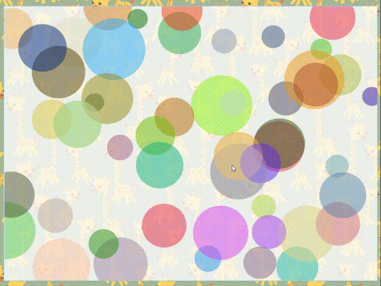

### 最前面

参考文章

> https://airingursb.gitbooks.io/canvas/content/

gitee

> https://gitee.com/Lemon-9/canvas-book-study

### HTML 5 元素

#### 定义

```html
  <canvas id="canvas">
    你的浏览器不支持canvas~
  </canvas>
```

#### 获取

```js
    const canvas = document.getElementById('canvas')
    // 获取画笔
    const context = canvas.getContext('2d')
```


### 线段 line

#### 基础画线方法

```js
  // 改变位置
  // context.moveTo(100, 100)
  // context.lineTo(600, 600)
  // context.stroke()
```

#### 线段的属性

```js
  /*
  * 线条有四个属性
  * lineCap 定义上下文中线的端点，可以有以下 3 个值。
  *     butt：默认值，端点是垂直于线段边缘的平直边缘。
  *     round：端点是在线段边缘处以线宽为直径的半圆。
  *     square：端点是在选段边缘处以线宽为长、以一半线宽为宽的矩形。
  *
  * lineJoin 定义两条线相交产生的拐角，可将其称为连接。
  *     miter：默认值，在连接处边缘延长相接。miterLimit 是角长和线宽所允许的最大比例(默认是 10)。
  *     bevel：连接处是一个对角线斜角。
  *     round：连接处是一个圆。
  * lineWidth
  * strokeStyle
  * */
```

#### 示例：lineCap 

```js
  context.lineWidth = 10
  context.strokeStyle = 'lightskyblue'
  // 方形线头
  context.beginPath()
  context.moveTo(100, 100)
  context.lineTo(400, 100)
  context.lineCap = 'square'
  context.stroke()

  // 默认线条
  context.beginPath()
  context.moveTo(100, 200)
  context.lineTo(400, 200)
  context.lineCap = 'butt'
  context.stroke()

  // 圆型线头
  context.beginPath()
  context.moveTo(100, 300)
  context.lineTo(400, 300)
  context.lineCap = 'round'
  context.stroke()
```

#### 示例：绘制折线

```js
  // 绘制折线
  const strokeLine = (startX: number, startY: number, color: string, lineJoin: CanvasLineJoin) => {
    context.beginPath()
    context.moveTo(startX, startY)
    const secondX = startX + 200
    const secondY = startY + 200
    context.lineTo(secondX, secondY)
    context.lineTo(startX, secondY + index * 50)
    context.strokeStyle = color
    context.lineWidth = 15
    context.lineJoin = lineJoin

    // 这个miterLimit规定了一个自动填充连接点的极限值. 只有 lineJoin 是 miter 时才生效
    context.miterLimit = 1
    context.stroke()
    context.closePath()
    index++
  }

  strokeLine(100, 150 , 'red', 'miter')
  strokeLine(300, 150 , 'blue', 'bevel')
  strokeLine(500, 150 , 'green', 'round')
  strokeLine(10, 10, 'green', 'miter')

```


### 矩形 rect

#### 定义

+ rect()

```js
  /*
  * 绘制矩形的快捷方法
  *   fillRect(x,y,width,height)
  *   strokeRect(x,y,width,height)
  * */
```

#### 示例：手动绘制矩形 和 调用rect()

```typescript
  const canvas: HTMLCanvasElement = <HTMLCanvasElement>document.getElementById('canvas')
  canvas.width = 800
  canvas.height = 600
  // 获取画笔
  const context = canvas.getContext('2d')
  /*
  * 绘制矩形
  *
  * 最后一笔会导致图形不闭合的问题，可以使用 context.closePath() 闭合
  * */
  const strokeRectangular = (startX: number, startY: number, color: string) => {
    // 标记从这里开始绘制，一定要加。
    context.beginPath()
    context.moveTo(startX, startY)
    context.lineTo(startX + 200, startY)
    context.lineTo(startX + 200, startY + 200)
    context.lineTo(startX, startY + 200)
    // 最后一笔可以不画
    // context.lineTo(startX, startY)
    // 图形闭合
    context.closePath()
    context.strokeStyle = color
    context.lineWidth = 5
    // 填充颜色
    context.fillStyle = 'lightskyblue'
    context.fill()
    context.stroke()
  }

  strokeRectangular(100, 100 , 'black')

  /*
  * 使用内置的 rect() 方法绘制矩形
  * */
  const strokeRect2 = (x: number, y: number, w: number, h: number, fillStyle: string) => {
    context.beginPath()
    context.rect(x, y, w, h)
    // 注意，此处可以不加 closePath()
    context.fillStyle = fillStyle
    context.fill()
    context.stroke()
    // context.closePath()
  }
  for (let i = 1; i < 10; i++) {
    const width = i * 20
    strokeRect2(300 + width, 100 + width, 400 - width * 2, 400 - width * 2,
      `rgb(${i * 10}, ${i * 20}, ${i * 20})`)
  }
```


### 填充 fillStyle 

+ 颜色 fillStyle = CSS
+ 线性渐变 createLinearGradient
+ 径向渐变 createRadialGradient
+ 图片 context.fillStyle = context.createPattern(img, 'repeat')

#### 示例：线性渐变

```js

  /*
  * 线性渐变
  * 1. 添加渐变线
  *   var grd = context.createLinearGradient(xstart,ystart,xend,yend);
  * 2. 添加关键色
  *   grd.addColorStop(stop,color);
  * 3. 应用渐变
  *   context.fillStyle = grd;
  *   context.strokeStyle = grd;
  * */
  context.rect(0, 0, 100, 100)
  // 渐变线
  const grd = context.createLinearGradient(0,100, 100, 100)
  grd.addColorStop(0, '#6688ff')
  grd.addColorStop(0.5, '#66ccff')
  grd.addColorStop(1, '#6688ff')
  context.fillStyle = grd
  context.fill()

```

#### 示例：径向渐变

```js
  /*
  * 径向渐变效果
  * 与线性渐变类似的方法，只是第一步调用的方法不同。
  * 1. 添加渐变圆
  *   // 在此定义两个圆。
  *   var grd = context.createRadialGradient(x0,y0,r0,x1,y1,r1);
  * 2. 添加关键色
  *   grd.addColorStop(stop,color);
  * 3. 应用渐变
  *   context.fillStyle = grd;
  *   context.strokeStyle = grd;
  * */
  context.beginPath()
  const grdCircle = context.createRadialGradient(500, 100, 0, 500, 100, 100)
  grdCircle.addColorStop(0, '#66ccff')
  grdCircle.addColorStop(1, '#66aaff')
  context.fillStyle = grdCircle
  context.fillRect(400, 0, 200, 200)
```


#### 示例：图片

```js
  const img = new Image()
  img.src = '../img/edu8-1.jpg'
  img.onload = () => {
    const pattern = context.createPattern(img, 'repeat')
    context.fillStyle = pattern
    context.fillRect(0, 0, 800, 600)
  }
```


### 绘制圆弧 arc

+ arc()
+ arcTo()
+ quadraticCurveTo() 二次贝塞尔
+ bezierCurveTo() 三次贝塞尔

#### 示例：基础圆弧、圆角矩形

```typescript

  /*
  * 使用 arc() 绘制圆弧
  *   context.arc(x,y,radius,startAngle,endAngle,anticlockwise)
  * 前面三个参数，分别是圆心坐标与圆半径。
  * startAngle、endAngle使用的是弧度值，不是角度值。弧度的规定是绝对的，
  *
  * anticlockwise表示绘制的方法，是顺时针还是逆时针绘制。它传入布尔值，true表示逆时针绘制，false表示顺时针绘制，缺省值为false。
  * */
  context.arc(100, 100, 100, 0, 2 * Math.PI, true)
  context.stroke()

  /*
  * 绘制圆角矩形
  * */
  const drawCircleRect = (x: number, y: number, r: number, width: number, height: number) => {
    context.beginPath()
    // 最上边
    context.moveTo(x - width / 2 + r, y - height / 2)
    context.lineTo(x + width / 2 - r, y - height / 2)
    // 最下边
    context.moveTo(x - width / 2 + r, y + height / 2)
    context.lineTo(x + width / 2 - r, y + height / 2)
    // 最左边
    context.moveTo(x - width / 2, y - height / 2 + r)
    context.lineTo(x - width / 2, y + height / 2 - r)
    // 最右边
    context.moveTo(x + width / 2, y - height / 2 + r)
    context.lineTo(x + width / 2, y + height / 2 - r)
    context.stroke()

    // 左上圆弧
    let center = {
      x: x - width / 2 + r,
      y: y - height / 2 + r
    }
    context.moveTo(center.x, center.y)
    context.beginPath()
    context.arc(center.x, center.y, r, Math.PI, 1.5 * Math.PI)
    context.stroke()

    // 右上圆弧
    center.x = x + width / 2 - r
    center.y = y - height / 2 + r
    context.moveTo(center.x, center.y)
    context.beginPath()
    context.arc(center.x, center.y, r, 0, 1.5 * Math.PI, true)
    context.stroke()

    // 左下圆弧
    center.x = x - width / 2 + r
    center.y = y + height / 2 - r
    context.moveTo(center.x, center.y)
    context.beginPath()
    context.arc(center.x, center.y, r, 0.5 * Math.PI, Math.PI)
    context.stroke()

    // 右下圆弧
    center.x = x + width / 2 - r
    center.y = y + height / 2 - r
    context.moveTo(center.x, center.y)
    context.beginPath()
    context.arc(center.x, center.y, r, 0, 0.5 * Math.PI)

    context.stroke()
  }
  drawCircleRect(400, 300, 20, 400, 300)
```


#### 示例：arcTo() 使用

```typescript
  /*
  * arcTo() 介绍
  *   arcTo(x1,y1,x2,y2,radius)
  * arcTo() 方法接收5个参数，分别是两个切点的坐标和圆弧半径。这个方法是依据切线画弧线，即由两个切线确定一条弧线。
  *
  * 这个函数以给定的半径绘制一条弧线，圆弧的起点与当前路径的位置到(x1, y1)点的直线相切，圆弧的终点与(x1, y1)点到(x2, y2)的直线相切。
  * 因此其通常配合`moveTo()`或`lineTo()`使用。其能力是可以被更为简单的`arc()`替代的，其复杂就复杂在绘制方法上使用了切点。
  *
  * */
  context.moveTo(200, 200)
  context.arcTo(600, 200, 600, 400, 100)
  context.stroke()
```


#### 示例：二次贝塞尔

```typescript
  /*
  * 二次贝塞尔曲线的方法：
  *   context.quadraticCurveTo(cpx,cpy,x,y);
  *
  * 这里和`acrTo()`有异曲同工之妙。P0是起始点，所以通常搭配`moveTo()`或`lineTo()`使用。P1(cpx, cpy)是控制点，P2(x, y)是终止点，
  * 它们不是相切的关系。
  *
  * 在线转换器： http://blogs.sitepointstatic.com/examples/tech/canvas-curves/quadratic-curve.html
  * */
  ctx.lineWidth = 6;
  ctx.strokeStyle = "#333";
  ctx.beginPath();
  ctx.moveTo(100, 250);
  ctx.quadraticCurveTo(250, 100, 400, 250);
  ctx.stroke();
```


#### 示例：三次贝塞尔

```typescript
  /*
  * 三次贝塞尔曲线的方法
  *   context.bezierCurveTo(cp1x,cp1y,cp2x,cp2y,x,y);
  *
  * 传入的6个参数分别为控制点cp1 (cp1x, cp1y)，控制点cp2 (cp2x, cp2y)，与终止点 (x, y)
  *
  * 在线转换器：http://blogs.sitepointstatic.com/examples/tech/canvas-curves/bezier-curve.html
  * */
  ctx.lineWidth = 6;
  ctx.strokeStyle = "#333";
  ctx.beginPath();
  ctx.moveTo(13, 272);
  ctx.bezierCurveTo(213, 105, 274, 369, 482, 257);
  ctx.stroke();
```


### 变换

```typescript
  /*
  * 图形变换
  *   1. 平移变换：`translate(x,y)`
  *   2. 旋转变换：`rotate(deg)`
  *   3. 缩放变换：`scale(sx,sy)`
  *   4. 矩阵变换：`transform()`
  * */
```

#### 平移变换

```typescript

  /*
  *`translate()`只传入两个参数，其实就是新画布坐标系原点的坐标
  *
  * 注意使用状态保存：在每次平移之前使用`context.save()`，在每次绘制之后，使用`context.restore()`
  * */
  ctx.fillStyle = 'lightskyblue'
  ctx.fillRect(100, 100, 200, 100)

  ctx.save()
  ctx.fillStyle = 'green'
  ctx.translate(200, 100)
  ctx.fillRect(100, 100, 200, 100)
  ctx.restore()

  ctx.save()
  ctx.fillStyle = 'red'
  ctx.translate(400, 200)
  ctx.fillRect(100, 100, 200, 100)
  ctx.restore()

```


#### 旋转变换

```typescript
  /*
  * 旋转变换
  *   rotate(deg) deg 是弧度
  * 这个的旋转是以坐标系的原点（0，0）为圆心进行的顺时针旋转。
  * 所以，在使用rotate()之前，通常需要配合使用translate()平移坐标系，确定旋转的圆心。
  * 即，旋转变换通常搭配平移变换使用的。
  * */
  for (let i = 0; i <= 12; i++) {
    context.save()
    context.translate(70 + i * 50, 50 + i * 40)
    context.fillStyle = '#00aaaa'
    context.fillRect(0, 0, 20, 20)
    context.restore()

    context.save()
    context.translate(70 + i * 50, 50 + i * 40)
    context.fillStyle = 'red'
    context.rotate(i * 30 * Math.PI / 180)
    context.fillRect(0, 0, 20, 20)
    context.restore()

  }

```


#### 示例：旋转变换绘制Logo

```typescript
  /*
  * 绘制魔性Logo
  * */
  context.save()
  context.translate(400, 200)
  context.fillStyle = '#ff000033'
  for (let i = 0; i < 10; i++) {
    context.save()
    context.rotate(36 * i * Math.PI / 180)
    context.fillRect(0, 0, 100, 100)
    context.restore()
  }
  context.restore()

```


#### 缩放变换

```typescript
  /*
  * 缩放变换
  *   scale(sx, sy)
  * 缩放变换scale(sx,sy)传入两个参数，分别是水平方向和垂直方向上对象的缩放倍数。
  * 例如context.scale(2,2)就是对图像放大两倍。
  *
  * 注意
  * 1. 缩放时，图像左上角坐标的位置也会对应缩放。
  * 2. 缩放时，图像线条的粗细也会对应缩放。
  * */
  context.strokeStyle = '#red'
  context.lineWidth = 5
  for (let i = 0; i < 4; i++) {
    context.save()
    context.scale(i, i)
    context.strokeRect(50, 50, 150, 100)
    context.restore()
  }
```


#### 矩阵变换

+ transform()方法
+ setTransform() 方法

```typescript
  /*
  * 矩阵变换
  *   context.transform(a,b,c,d,e,f)
  *  - a 水平缩放（1）
  *  - b 水平倾斜（0）
  *  - c 垂直倾斜（0）
  *  - d 垂直缩放（1）
  *  - e 水平位移（0）
  *  - f 垂直位移（0）
  *
  * 当我们想对一个图形进行变换的时候，只要对变换矩阵相应的参数进行操作，
  * 操作之后，对图形的各个定点的坐标分别乘以这个矩阵，就能得到新的定点的坐标。
  * */

```


#### 示例：矩阵变换替代其他变换

```typescript
  /*
  * 平移变换
  * 可以使用 context.transform (1,0,0,1,dx,dy)代替context.translate(dx,dy)。
  * 也可以使用 context.transform(0,1,1,0,dx,dy)代替
  * */

  /*
  * 缩放变换
  * 可以使用 context.transform(sx,0,0,sy,0,0)代替context.scale(sx, sy);
  * 也可以使用context.transform(0,sy,sx,0,0,0)
  * */

  /*
  * 旋转变换
  * 结论复杂，没有使用的意义。
  * context.transform(Math.cos(θ*Math.PI/180)，Math.sin(θ*Math.PI/180), -Math.sin(θ*Math.PI/180),Math.cos(θ*Math.PI/180)，0，0）可以替代context.rotate(θ)
  * 也可以使用 context.transform(-Math.sin(θ*Math.PI/180),Math.cos(θ*Math.PI/180)， Math.cos(θ*Math.PI/180)，Math.sin(θ*Math.PI/180)，0，0）替代。
  * */

  /*
  * 倾斜效果（最实用）
  * 使用context.transform(0,b,c,0,0,0)来实现倾斜效果
  * */
  context.fillStyle = 'yellow'
  context.strokeStyle = '#00AAAA'
  context.lineWidth = 2

  context.save()
  // 平移到 (300， 200)
  context.transform(1, 0, 0, 1, 300, 200)
  // 水平放大2倍， 垂直放大1.5倍
  context.transform(2, 0, 0, 1.5, 0, 0)
  context.fillRect(0, 0, 200, 200)
  // 水平方向向右倾斜宽度10%的距离，垂直方向向上倾斜高度10%的距离
  context.transform(1, -0.1, 0.1, 1, 0, 0)
  context.fillRect(0, 0, 200, 200)
  context.strokeRect(0, 0, 200, 200)
  context.restore()

```

#### 示例：setTransform() 方法

```typescript
  /*
  * setTransform() 方法
  * transform()方法的行为相对于由 rotate(),scale(), translate(), or transform() 完成的其他变换。
  * 例如：如果我们已经将绘图设置为放到两倍，则 transform() 方法会把绘图放大两倍，那么我们的绘图最终将放大四倍。这一点和之前的变换是一样的。
  * 但是setTransform()不会相对于其他变换来发生行为。它的参数也是六个，context.setTransform(a,b,c,d,e,f)，与transform()一样。
  * */

  context.fillRect(200, 100, 250, 100)

  context.setTransform(1, 0.5, -0.5, 2, 30, 10)
  context.fillStyle = 'red'
  context.fillRect(200, 100, 250, 100)

  context.setTransform(1, 0.5, -0.5, 2, 30, 10)
  context.fillStyle = 'blue'
  context.fillRect(200, 100, 250, 100)

```


### 文本 Text

```typescript
  /*
  * 文本API
  *
  * 属性：
  *   font  设置或返回文本内容的当前字体属性
  *   textAlign   设置或返回文本内容的当前对齐方式
  *   textBaseLine  设置或返回在绘制文本时使用的当前文本基线
  *
  * 方法：
  *   fillText()  在画布上绘制“被填充的”文本
  *   strokeText()  在画布上绘制文本（无填充）
  *   measureText() 返回包含指定文本对象的宽度
  * */
```

#### 示例：文本渲染配合渐变

```typescript

  /*
  * 基本文字显示
  * 1. 使用 font 设置字体 这里的font属性可以不指定，如果没有指定字体，则默认自动使用 10px 无衬线体。
  * 2. 使用 fillStyle 设置字体颜色
  * 3. 使用 fillText() 方法显示字体
  * */

  // context.font = '50px serif '
  // context.fillStyle = '#00AAAA'
  // context.fillText('《CANVAS--Draw on the Web》', 50, 300)

  /*
  * 文本渲染
  * fillText()与strokeText()的参数表是一样的，接受4个参数，分别是String，x，y与maxlen，
  * 其中String是指要显示的字符串，之后x与y是指显示的坐标，最后一个maxlen是可以缺省的数值型参数，代表显示的最大宽度，单位是像素。
  * 如果文本的长度超过了这个maxlen，Canvas就会将显示文本横向压缩。通常为了保证字体的美观，我们不设置maxlen。
  * */

  context.beginPath()
  context.font = '50px Verdana'
  const gradient = context.createLinearGradient(0, 0, 800, 0)
  gradient.addColorStop(0, 'magenta')
  gradient.addColorStop(0.5, 'blue')
  gradient.addColorStop(1, 'red')
  context.fillStyle = gradient
  context.strokeStyle = '#00AAAA'
  context.strokeText('airingursb.github.io', 50, 100)
  context.fillText('airingursb.github.io', 50, 200)
  //限制宽度
  context.fillText("airingursb.github.io", 50, 300, 200);

```


#### 示例：文本水平对齐方式

```typescript
  /*
  * 水平对齐 textAlign
  * context.textAlign="center|end|left|right|start";
  * */
  context.strokeStyle = 'blue'
  context.moveTo(400, 100)
  context.lineTo(400, 500)
  context.stroke()
  context.font = '30px Arial'

  context.textAlign = 'start'
  context.strokeText('textAlign = start', 400, 150)

  context.textAlign = 'end'
  context.strokeText('textAlign = start', 400, 200)

  context.textAlign = 'center'
  context.strokeText('textAlign = start', 400, 250)

  context.textAlign = 'left'
  context.strokeText('textAlign = start', 400, 300)

  context.textAlign = 'right'
  context.strokeText('textAlign = start', 400, 350)

```


#### 示例：文本垂直对齐方式、度量换行

```typescript

  /*
  * 垂直对齐 textBaseline
  * context.textBaseline="alphabetic|top|hanging|middle|ideographic|bottom"
  * alphabetic - 默认。文本基线是普通的字母基线。
  * top - 文本基线是 em 方框的顶端。
  * hanging - 文本基线是悬挂基线。
  * middle - 文本基线是 em 方框的正中。
  * ideographic	 - 文本基线是表意基线。
  * bottom - 文本基线是 em 方框的底端。
  * */
  context.strokeStyle = 'blue'
  context.moveTo(0, 300)
  context.lineTo(800, 300)
  context.stroke()

  context.fillStyle = '#00AAAA'
  context.font = '20px Arial'

  context.textBaseline = 'alphabetic'
  context.fillText('alphabetic', 0, 300)

  context.textBaseline = 'top'
  context.fillText('top', 100, 300)

  context.textBaseline = 'bottom'
  context.fillText('bottom', 200, 300)

  context.textBaseline = 'hanging'
  context.fillText('hanging', 300, 300)

  context.textBaseline = 'middle'
  context.fillText('middle', 400, 300)

  /*
  * 文本度量
  *   measureText()
  * context.measureText(text).width
  * 可以用来做换行。
  * */

  context.textAlign = 'center'
  context.textBaseline = 'middle'
  context.fillStyle = '#00AAAA'
  context.font = '30px Arial'
  const text = 'Hello Canvas'
  context.fillText('width: ' + context.measureText(text).width, 400, 200)
  context.fillText(text, 400, 150)
```


### 阴影 shadow

#### 阴影和透明

```typescript
  /*
  * 阴影效果
  *
  * context.shadowColor：阴影颜色。
  * context.shadowOffsetX：阴影x轴位移。正值向右，负值向左。
  * context.shadowOffsetY：阴影y轴位移。正值向下，负值向上。
  * context.shadowBlur：阴影模糊滤镜。数据越大，扩散程度越大。
  * */

  context.save()
  context.shadowColor = 'red'
  context.shadowOffsetY = 5
  context.shadowOffsetY = 5
  context.shadowBlur = 2
  context.font = '50px Arial'
  context.strokeText('Text', 200, 200)
  context.restore()
  /*
  * 全局透明
  *   globalAlpha
  * 默认为 1.0
  * */
  context.globalAlpha = 0.5
  for (let i = 0; i < 50; i++) {
    const R = Math.floor(Math.random() * 255)
    const G = Math.floor(Math.random() * 255)
    const B = Math.floor(Math.random() * 255)

    context.fillStyle = `rgb(${R}, ${G}, ${B})`
    context.beginPath()
    context.arc(Math.random() * canvas.width, Math.random() * canvas.height, Math.random() * 100, 0, Math.PI * 2)
    context.fill()
  }
```


### 图像合成 globalCompositeOperation

```typescript
  /*
  * 图像合成 globalCompositeOperation
  * 两个图像重合的时候，就涉及到了对这两个图像的合成处理。
  * globalCompositeOperation属性设置或返回如何将一个源（新的）图像绘制到目标（已有）的图像上。
  *
  * 源图像 = 您打算放置到画布上的绘图。
  * 目标图像 = 您已经放置在画布上的绘图。
  *
  * source-over	- 默认。在目标图像上显示源图像。
  * source-atop 在目标图像顶部显示源图像。源图像位于目标图像之外的部分是不可见的
  * source-in
  * source-out
  * destination-over 在源图像上方显示目标图像。
  * destination-atop
  * destination-in
  * destination-out
  * lighter 显示源图像 + 目标图像。
  * copy 显示源图像。忽略目标图像。
  * xor	使用异或操作对源图像与目标图像进行组合。
  * */
  context.globalCompositeOperation = "source-out";
  context.globalAlpha = 0.5;

  for(let i=0; i<=50; i++){
    const R = Math.floor(Math.random() * 255)
    const G = Math.floor(Math.random() * 255)
    const B = Math.floor(Math.random() * 255)

    context.fillStyle = "rgb(" + R + "," + G + "," + B + ")";

    context.beginPath();
    context.arc(Math.random() * canvas.width, Math.random() * canvas.height, Math.random() * 100, 0, Math.PI * 2);
    context.fill();
  }
```


### 裁剪 clip

```typescript

  /*
  * 裁剪区域 clip()
  * Canvas API的图像裁剪功能是指，在画布内使用路径，只绘制该路径内所包含区域的图像，不绘制路径外的图像。
  * 裁剪是对画布进行的，裁切后的画布不能恢复到原来的大小
  * */
  context.fillStyle = 'black'
  context.fillRect(10, 10, 200, 200)

  context.save()
  context.beginPath()
  // 裁剪画布从(0，0)点至(50，50)的正方形
  context.rect(0, 0, 50, 50)
  context.clip()

  // 红色圆
  context.beginPath()
  context.strokeStyle = 'red'
  context.lineWidth = 5
  context.arc(100, 100, 100, 0, Math.PI * 2, false)

  // 整圆
  context.stroke()
  context.closePath()
  context.restore()

  context.rect(0, 0, 500, 500)
  context.clip()
  // 绘制一个没有裁切的蓝线
  context.beginPath();
  context.strokeStyle = "blue";
  context.lineWidth = 5;
  context.arc(100,100,50,0,Math.PI * 2,false);
  // 整圆
  context.stroke();
  context.closePath();
```


### 引用图像、视频等 drawImage()

```typescript

  /*
  * 绘制图像 drawImage()
  * 可以引入图像、画布、视频，并对其进行缩放或裁剪
  * 三参数：context.drawImage(img,x,y)
  * 五参数：context.drawImage(img,x,y,width,height)
  * 九参数：context.drawImage(img,sx,sy,swidth,sheight,x,y,width,height)
  *
  * img	规定要使用的图像、画布或视频。
  * sx	可选。开始剪切的 x 坐标位置。
  * sy	可选。开始剪切的 y 坐标位置。
  * swidth	可选。被剪切图像的宽度。
  * sheight	可选。被剪切图像的高度。
  * x	在画布上放置图像的 x 坐标位置。
  * y	在画布上放置图像的 y 坐标位置。
  * width	可选。要使用的图像的宽度。（伸展或缩小图像）
  * height	可选。要使用的图像的高度。（伸展或缩小图像）
  * */
  context.beginPath();
  context.moveTo(400,260);
  context.bezierCurveTo(450,220,450,300,400,315);
  context.bezierCurveTo(350,300,350,220,400,260);
  context.clip();
  context.closePath();
  const img = new Image()
  img.src = '../img/20-1.jpg'
  img.onload = () => {
    context.drawImage(img, 348,240,100,100)
  }
```


### 镂空效果

#### 路径方向与非零环绕原则

平时我们画的图形都是规规矩矩的，那么如果我们用线条画了个抽象派作品，就像下面这图一样，童鞋们知道怎么用`fill()`染色呢？


这里就要用到数学上的一个方法——非零环绕原则，来判断哪块区域是里面，哪块区域是外面。接下来，我们具体来看下什么是非零环绕原则。


首先，我们得给图形确定一条路径，只要“一笔画”并且“不走重复路线”就可以了。如图，标出的是其中的一种路径方向。我们先假定路径的正方向为1（其实为-1啥的也都可以，正负方向互为相反数，不是0就行），那么反方向就是其相反数-1。

然后，我们在子路径切割的几块区域内的任意一点各取一条方向任意的射线，这里我只取了三个区域的射线为例，来判断这三块区域是“里面”还是“外面”。

接下来，我们就来判断了。S1中引出的射线L1，与S1的子路径的正方向相交，那么我们就给计数器+1，结果为+1，在外面。

S2中引出的射线L2，与两条子路径的正方向相交，计数器+2，结果为+2，在外面。

S3中引出的射线L3，与两条子路径相交，但是其中有一条的反方向，计数器+1-1，结果为0，在里面。没错，只要结果不为0，该射线所在的区域就在外面。

#### 示例：镂空效果

```typescript
  context.beginPath()
  context.rect(200, 100, 400, 400)
  drawPathRect(context, 250, 150, 300, 150)
  drawPathTriangle(context, 345, 350, 420, 450, 270, 450)
  context.arc(500, 400, 50, 0, Math.PI * 2, true)
  context.closePath()

  context.fillStyle = "#058";
  context.shadowColor = "gray";
  context.shadowOffsetX = 10;
  context.shadowOffsetY = 10;
  context.shadowBlur = 10;
  context.fill();
  //逆时针绘制矩形
  function drawPathRect (cxt, x, y, w, h) {
    /**
     * 这里不能使用beginPath和closePath，
     * 不然就不属于子路径而是另一个全新的路径，
     * 无法使用非零环绕原则
     */
    cxt.moveTo(x, y)
    cxt.lineTo(x, y + h)
    cxt.lineTo(x + w, y + h)
    cxt.lineTo(x + w, y)
    cxt.lineTo(x, y)

  }

  //逆时针绘制三角形
  function drawPathTriangle (cxt, x1, y1, x2, y2, x3, y3) {
    cxt.moveTo(x1, y1)
    cxt.lineTo(x3, y3)
    cxt.lineTo(x2, y2)
    cxt.lineTo(x1, y1)
  }
```


### 橡皮擦 clearRect()

```typescript
  /*
  * 橡皮擦 clearRect()
  * */

  //清空画布
  context.clearRect(0,0,canvas.width,canvas.height);

```


### 事件和其他API

#### 示例：点泡泡小游戏

+  isPointInPath()   这个方法接收两个参数，就是一个点的坐标值，用来判断指定的点是否在当前路径中。若是，则返回true。 

```typescript

  var balls = [];
  for(var i=0; i<50; i++){
    var aBall = {
      x: Math.random() * canvas.width,
      y: Math.random() * canvas.height,
      r: Math.random() * 50 + 20
    };
    balls[i] = aBall;
  }

  draw();
  canvas.addEventListener("mousemove",detect);

  function draw(){
    for(var i=0; i<balls.length; i++){
      context.beginPath();
      context.arc(balls[i].x, balls[i].y, balls[i].r, 0, Math.PI *2);
      context.globalAlpha = 0.5;

      var R = Math.floor(Math.random() * 255);
      var G = Math.floor(Math.random() * 255);
      var B = Math.floor(Math.random() * 255);

      context.fillStyle = "rgb(" + R + "," + G + "," + B + ")";
      context.fill();

    }
  }

  function detect(event){
    var x = event.clientX - canvas.getBoundingClientRect().left;
    var y = event.clientY - canvas.getBoundingClientRect().top;

    for(var i=0; i<balls.length; i++){
      context.beginPath();
      context.arc(balls[i].x, balls[i].y, balls[i].r, 0, Math.PI * 2);

      if(context.isPointInPath(x,y)){
        context.fillStyle = "rgba(255,255,255,0.1)";
        context.fill();
      }
    }
  }
```


