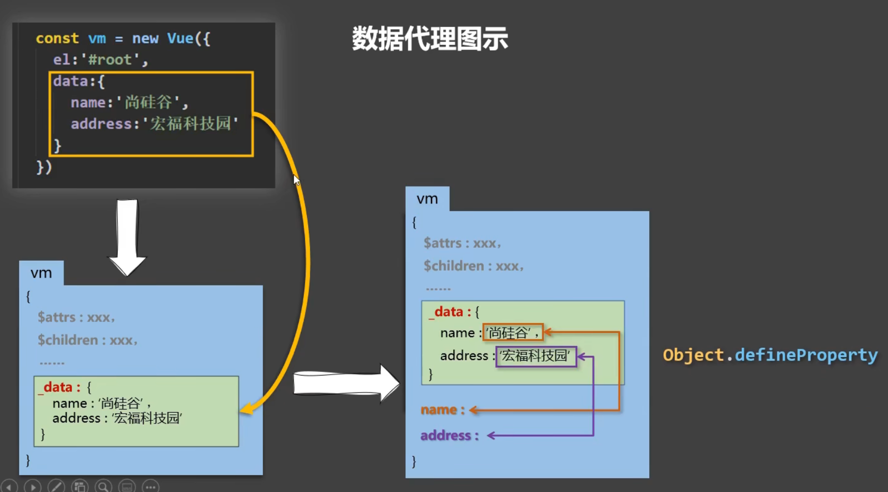

## Vue2 复习

### 1.  Vue响应式原理：Object.defineProperty 数据代理

```js
	let number = 18
	const person = {
		name: '张三'
	}
	// 这个方法可以控制对象的变量。
	// 是否可修改、是否可枚举等，还可以进行数据劫持
	Object.defineProperty(person, 'age', {
		 // enumerable:true, //控制属性是否可以枚举，默认值是false
		 // writable:true, //控制属性是否可以被修改，默认值是false
		 // configurable:true //控制属性是否可以被删除，默认值是false
		get () {
			return number
		},
		set (value) {
			number = value
		}
	})

```
vue中：



### 2. props 限制类型
 ```js
    // 简单语法
    Vue.component('props-demo-simple', {
      props: ['size', 'myMessage']
    })
    
    // 对象语法，提供验证
    Vue.component('props-demo-advanced', {
      props: {
        // 检测类型
        height: Number,
        // 检测类型 + 其他验证
        age: {
          type: Number,
          default: 0,
          required: true,
          validator: function (value) {
            return value >= 0
          }
        }
      }
    })
 ```
### 3. mixin 混入
可以混入不同的OptonsAPI
```js
    export default {
        name:'Student',
        data() {
            return {
                name:'张三',
                sex:'男'
            }
        },
        // mixins:[hunhe,hunhe2]
    }

```

### 4. 查看NPM包版本
```
npm view webpack version
```
### 5. 全局事件bus的写法

```js
//创建vm
new Vue({
	el:'#app',
	render: h => h(App),
	beforeCreate() {
		Vue.prototype.$bus = this //安装全局事件总线
	},
})
```

使用JS文件const 常量约定事件名称。

### 6. 插槽

+ 默认插槽
+ 具名插槽
+ 作用域插槽

### 7. 路由props

```js

[
    {
        name:'xiangqing',
        path:'detail',
        component:Detail,

        //props的第一种写法，值为对象，该对象中的所有key-value都会以props的形式传给Detail组件。
        // props:{a:1,b:'hello'}

        //props的第二种写法，值为布尔值，若布尔值为真，就会把该路由组件收到的所有params参数，以props的形式传给Detail组件。
        // props:true

        //props的第三种写法，值为函数
        props($route){
            return {
                id:$route.query.id,
                title:$route.query.title,
                a:1,
                b:'hello'
            }
        }

    }
]
```

```vue
<template>
	<ul>
		<li>消息编号：{{id}}</li>
		<li>消息标题：{{title}}</li>
	</ul>
</template>

<script>
	export default {
		name:'Detail',
		props:['id','title'],
		computed: {
			// id(){
			// 	return this.$route.query.id
			// },
			// title(){
			// 	return this.$route.query.title
			// },
		},
		mounted() {
			// console.log(this.$route)
		},
	}
</script>
```

### 8. replace 、push区别

replace不会保存浏览器历史记录

### 9. 缓存路由组件 及其 生命周期钩子

```html
<!-- 缓存一个路由组件 -->
<keep-alive include="News">
    <router-view></router-view>
</keep-alive>
```

```js
export default {
		name:'News',
		data() {
			return {
				opacity:1
			}
		},
		/* beforeDestroy() {
			console.log('News组件即将被销毁了')
			clearInterval(this.timer)
		}, */
		/* mounted(){
			this.timer = setInterval(() => {
				console.log('@')
				this.opacity -= 0.01
				if(this.opacity <= 0) this.opacity = 1
			},16)
		}, */
		activated() {
			console.log('News组件被激活了')
			this.timer = setInterval(() => {
				console.log('@')
				this.opacity -= 0.01
				if(this.opacity <= 0) this.opacity = 1
			},16)
		},
		deactivated() {
			console.log('News组件失活了')
			clearInterval(this.timer)
		},
	}
```

### 10. 路径 <%= BASE_URL %>

```html
<!DOCTYPE html>
<html lang="">
  <head>
    <meta charset="utf-8">
		<!-- 针对IE浏览器的一个特殊配置，含义是让IE浏览器以最高的渲染级别渲染页面 -->
    <meta http-equiv="X-UA-Compatible" content="IE=edge">
		<!-- 开启移动端的理想视口 -->
    <meta name="viewport" content="width=device-width,initial-scale=1.0">
		<!-- 配置页签图标 -->
    <link rel="icon" href="<%= BASE_URL %>favicon.ico">
		<!-- 引入第三方样式 -->
		<link rel="stylesheet" href="<%= BASE_URL %>css/bootstrap.css">
		<!-- 配置网页标题 -->
    <title>硅谷系统</title>
  </head>
  <body>
		<!-- 当浏览器不支持js时noscript中的元素就会被渲染 -->
    <noscript>
      <strong>We're sorry but <%= htmlWebpackPlugin.options.title %> doesn't work properly without JavaScript enabled. Please enable it to continue.</strong>
    </noscript>
		<!-- 容器 -->
    <div id="app"></div>
    <!-- built files will be auto injected -->
  </body>
</html>

```

### 11. 配置代理

```js
module.exports = {
  pages: {
    index: {
      //入口
      entry: 'src/main.js',
    },
  },
	lintOnSave:false, //关闭语法检查
	//开启代理服务器（方式一）
	/* devServer: {
    proxy: 'http://localhost:5000'
  }, */
	//开启代理服务器（方式二）
	devServer: {
    proxy: {
      '/atguigu': {
        target: 'http://localhost:5000',
				pathRewrite:{'^/atguigu':''},
        // ws: true, //用于支持websocket
        // changeOrigin: true //用于控制请求头中的host值
      },
      '/demo': {
        target: 'http://localhost:5001',
				pathRewrite:{'^/demo':''},
        // ws: true, //用于支持websocket
        // changeOrigin: true //用于控制请求头中的host值
      }
    }
  }
}
```

### 