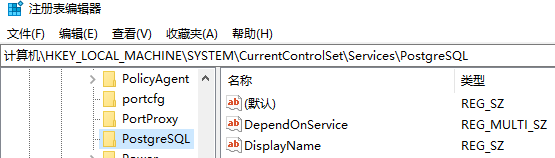
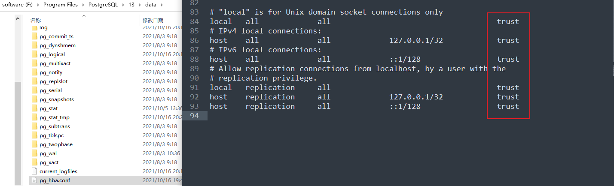

# postgres sql连接失败/没有PostgreSQL服务/忘记密码问题解决

## 1. postgres sql连接失败

报错信息：could not connect to server: Connection refused (0x0000274D/10061) Is the server running on host "localhost" (::1) and accepting TCP/IP connections on port 5432? could not connect to server: Connection refused (0x0000274D/10061) Is the server running on host "localhost" (127.0.0.1) and accepting TCP/IP connections on port 5432?


解决：

重新启动PostgreSQL服务
![[assets/pgssql无法连接问题.assets/image-20211016202740883.png]]


## 2. 没有PostgreSQL服务问题

1. 注册表编辑器，删除此文件夹

   

2. 重启

3. cd到安装目录

   ```
   F:\Program Files\PostgreSQL\13\bin
   ```

   输入以下命令(管理员打开cmd) 注意 -D 后面是data的路径

   ```cmd
   pg_ctl.exe register -N "PostgreSQL" -U "NT AUTHORITY\NetworkService" -D "F:\Program Files\PostgreSQL\13\data" -w
   ```

   

## 3. 忘记密码

1. 找安装目录，按下图修改红框



2. 打开pgAdmin，不用输密码就可连上

如何修改密码见这篇文章：https://blog.csdn.net/u013719339/article/details/51232908


参考文章：

https://stackoverflow.com/questions/27566859/how-to-run-postgresql-as-a-service-in-windows

https://stackoverflow.com/questions/40532399/unable-to-connect-to-server-for-postgres
